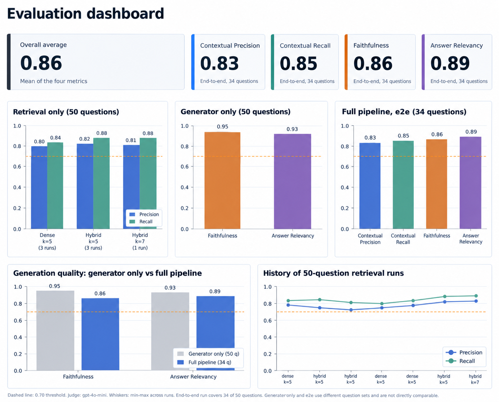

# Enterprise RAG for LangChain and LangGraph Documentation

A retrieval-augmented generation system that answers technical questions about the LangChain and LangGraph Python libraries and cites the documentation sections each answer is based on. It combines dense and sparse retrieval, parent-child chunk merging, and a streaming FastAPI service.

## Features

- Structure-aware chunking that splits on markdown headings and keeps code blocks intact
- Hybrid retrieval using dense and sparse (BM25) search in a single Qdrant collection, merged with Reciprocal Rank Fusion
- Auto-merging of sibling chunks into their parent section for fuller context
- Answers with inline citations to the source sections
- Token streaming over Server-Sent Events, orchestrated with LangGraph
- Evaluation harness built on DeepEval with a 50-question golden dataset

## Tech Stack

| Component | Technology |
|---|---|
| Ingestion and retrieval | LlamaIndex |
| Orchestration | LangGraph |
| Vector database | Qdrant |
| Relational database | PostgreSQL 16 |
| Sparse encoding | FastEmbed (BM25) |
| Embeddings | text-embedding-3-small |
| LLM | gpt-4o-mini |
| API | FastAPI, Uvicorn |
| Evaluation | DeepEval |

## Architecture

```
User question
      |
      v
Embedding model (text-embedding-3-small)
      |
      +--------------------+
      |                    |
      v                    v
Dense search          Sparse (BM25) search
      |                    |
      +----------+---------+
                 |
                 v
     Reciprocal Rank Fusion
                 |
                 v
        Top-k leaf chunks
                 |
                 v
   Auto-merge (leaf -> parent)
                 |
                 v
      LLM (LangGraph generator)
                 |
                 v
      Answer with citations
```

Documents are split into parent sections and smaller leaf chunks. Only leaf chunks are indexed in Qdrant, so search runs on small, precise units. When several sibling leaves appear in the results, they are replaced by their parent section before being passed to the LLM.

PostgreSQL is the source of truth for all chunks. Qdrant and the parent docstore are derived from it and can be rebuilt at any time.

## Getting Started

### Prerequisites

- Python 3.12 or later
- Docker and Docker Compose
- An API key for an OpenAI-compatible gateway (this project uses airouter.in)

### Installation

```bash
git clone <repo>
cd enterprise-rag

python -m venv .venv
source .venv/bin/activate        # macOS/Linux
.venv\Scripts\activate           # Windows

pip install -r requirements.txt
pip install -e ".[dev]"
```

### Configuration

```bash
cp .env.example .env
```

Open `.env` and set `EMBEDDING_API_KEY`. If you use a different gateway, also set `EMBEDDING_BASE_URL`.

### Start infrastructure

```bash
docker compose up -d postgres qdrant
alembic upgrade head
```

### Ingest the corpus

Run the following scripts in order:

```bash
python scripts/pull_docs.py --out data/raw --max-docs 200
python scripts/clean_all.py
python scripts/chunk_all.py
python scripts/load_chunks_db.py
python scripts/embed_all.py
python scripts/push_qdrant.py
```

### Run the API

```bash
python scripts/serve.py
```

To run the full stack in Docker instead:

```bash
docker compose build api
docker compose run --rm api python -c "from fastembed import SparseTextEmbedding; SparseTextEmbedding('Qdrant/bm25')"
docker compose up -d
```

The second command downloads the BM25 model into the image before the first start.

## Usage

The API listens on `http://localhost:8000`.

| Endpoint | Method | Description |
|---|---|---|
| `/health` | GET | Health check |
| `/docs` | GET | Interactive OpenAPI documentation |
| `/chat` | POST | Returns the complete answer as one response |
| `/chat/stream` | POST | Streams the answer token by token over SSE |

Standard request:

```bash
curl -X POST http://localhost:8000/chat \
  -H "Content-Type: application/json" \
  -d '{"message": "How do I add memory to a LangGraph agent?"}'
```

Streaming request:

```bash
curl -N -X POST http://localhost:8000/chat/stream \
  -H "Content-Type: application/json" \
  -d '{"message": "What is create_agent?"}'
```

## Corpus

The system indexes 150 documentation pages across three library versions.

| Library | Version | Pages | Source |
|---|---|---|---|
| LangChain | 1.x | 61 | `langchain-ai/docs` (main) |
| LangGraph | 1.x | 40 | `langchain-ai/docs` (main) |
| LangGraph | 0.6 | 49 | `langchain-ai/langgraph` (0.6 branch) |

Repositories are shallow-cloned and pinned by commit SHA. `data/raw/manifest.jsonl` records the SHA, source URL, and content hash of every file.

### Cleaning

The current documentation is written in Mintlify MDX and the 0.6 documentation in MkDocs Material markdown. The cleaner detects the format and:

- Moves front matter into metadata
- Removes import statements
- Keeps Python blocks and drops JavaScript blocks in `:::python` / `:::js` conditionals
- Unwraps JSX components and keeps their inner text
- Converts MkDocs admonitions to blockquotes
- Normalizes code fence language tags

### Chunking

A custom chunker (`src/rag/ingestion/chunkers.py`) produces 1,599 parent sections and 2,766 leaf chunks.

- Sections are split on markdown headings
- Code fences are never split
- Sections over the token limit are divided at paragraph boundaries
- Very short sections are merged into their neighbor
- Chunk IDs are deterministic, so re-chunking unchanged documents yields identical IDs

LlamaIndex's built-in `HierarchicalNodeParser` and `MarkdownNodeParser` were not used because they split code blocks incorrectly and, in the version tested, `HierarchicalNodeParser` does not set the relationships that auto-merging depends on.


## Evaluation

### Dataset

The golden dataset (`evals/datasets/golden_retriever.jsonl`) contains 50 hand-verified questions. Each entry has a question, a reference answer, and the IDs of the leaf chunks that contain the answer. The categories are `how_to`, `concept`, `api_reference`, `multi_hop`, `version_specific`, `troubleshooting`, and `unanswerable`.

Gold chunks were annotated by running the retriever on each question, reading the top 20 results, and marking the chunks that contain the answer. Any chunk that contained the answer but was not retrieved was located in PostgreSQL and added, so the gold set is not biased toward what the retriever already finds.

### Metrics

All metrics come from DeepEval and are scored by an LLM judge (gpt-4o-mini) with a pass threshold of 0.70.

| Stage | Metric | Measures |
|---|---|---|
| Retrieval | Contextual Precision | Whether relevant chunks are ranked above irrelevant ones |
| Retrieval | Contextual Recall | Whether the retrieved context contains the information needed for the reference answer |
| Generation | Faithfulness | Whether the answer is supported by the retrieved context |
| Generation | Answer Relevancy | Whether the answer addresses the question |

### Dashboard



The dashboard is generated from the run logs with `python scripts/make_dashboard.py`.

### Retrieval results

Mean over the 50-question runs, with automerge enabled. Judge scores vary between runs, so the table shows the mean and the range.

| Mode | k | Runs | Contextual Precision | Contextual Recall |
|---|---|---|---|---|
| Dense | 5 | 3 | 0.783 (0.757 - 0.798) | 0.832 (0.822 - 0.838) |
| Hybrid (RRF) | 5 | 3 | 0.763 (0.726 - 0.816) | 0.854 (0.825 - 0.881) |
| Hybrid (RRF) | 7 | 1 | 0.809 | 0.878 |

Hybrid retrieval improves recall by roughly two points on average. Precision differences are within the run-to-run variation of the judge, so no precision gain is claimed.

### Generation and end-to-end results

| Evaluation | Questions | Faithfulness | Answer Relevancy |
|---|---|---|---|
| Generator only | 50 | 0.947 | 0.925 |
| Full pipeline (hybrid, k=5, no reranker) | 34 | 0.862 | 0.887 |

The full pipeline also scored 0.833 on Contextual Precision and 0.850 on Contextual Recall, for an overall average of 0.858 across the four metrics.

### Limitations of these results

- The end-to-end run covers 34 of the 50 questions. The remaining 16 were not scored because the run did not complete.
- The generator-only and end-to-end runs use different question sets, so the difference between them should not be read as a measured regression.
- Contextual Relevancy was only measured on a 10-question debugging run and is not reported.
- A reranker code path exists but has not been evaluated, so no reranker results are included.
- Each configuration was run a small number of times with a single judge model.

## Design Decisions

**Custom chunker.** LlamaIndex's `MarkdownNodeParser` and `HierarchicalNodeParser` split code blocks incorrectly and, in the version tested, `HierarchicalNodeParser` does not set the relationships that `AutoMergingRetriever` needs. A structure-aware chunker keeps code fences intact and gives full control over parent and leaf relationships. Each failure case has a regression test in `tests/unit/`.

**Leaf-only indexing.** Only leaf chunks are stored in Qdrant. Search runs on small units, and parents are attached afterward by the auto-merging step. This avoids parents and leaves competing in the same result list.

**Hybrid collection from the start.** The Qdrant collection holds both dense and sparse vectors. A sparse vector space cannot be added to an existing dense-only collection without recreating it, so it was enabled at the first push.

**Reciprocal Rank Fusion.** The default LlamaIndex fusion normalizes dense and sparse scores, which sit on different scales. RRF combines results by rank position and does not depend on score scale. The implementation in `src/rag/retrieval/fusion.py` also handles the case where one side returns no results.

**PostgreSQL as the source of truth.** Qdrant and the parent docstore are both derived from PostgreSQL. If the embedding model changes or the docstore is lost, both can be rebuilt without re-running ingestion. The `chunks.index_status` column tracks synchronization.

**In-memory parent docstore.** At 1,599 parents the docstore is about 3 MB, so a file-backed `SimpleDocumentStore` is sufficient. A larger corpus would need a shared store such as Redis.